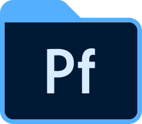

<h1>Qui suis-je ?</h1>

Fekyfa

Je m'appelle Philemon Demarelatrous.

<h1> Me Contacter:</h1>

<h4>Mes informations & réseaux<h4>
<a href="https://drive.google.com/drive/folders/1kTi0uwh_8ks48a5p9bjvG0xMaf-EsW6T?usp=sharing">&nbsp;Portfolio
  
<a href="https://www.behance.net/fekyfaofficial">&nbsp;Behance
  
<a href="https://www.linkedin.com/in/philemon-demarelatrous-4490b7213/">&nbsp;Linkedin

<h1>Mes Languages et outils:</h1>

&nbsp;Visual Studio Code
&nbsp;HTML 5
&nbsp;CSS 3

<h3>Mes Stats Github</h3>
